<style>
  :root {
    --color-background: #fff;
    --color-background-code: #E0E0E0;
    --color-background-paginate: rgba(128, 128, 128, 0.05);
    --color-foreground: #345;
    --color-highlight: #99c;
    --color-highlight-hover: #aaf;
    --color-highlight-heading: #99c;
    --color-header: #bbb;
    --color-header-shadow: transparent;
  }

{
  font-size: 25px
}
</style>

# High Performance Computing
## Exercises 1 and 2c
#### Emanuele Ruoppolo - SM3800049
_Università degli Studi di Trieste - a.a. 2023-2024_ 
**25 november 2024**

---
## Exercise 1
# Performance Evaluation 
# OpenMPI collective operations

``broadcast`` and ``scatter`` operations

---

## Problem statement
1. Estimate the latency of default openMPI implementation of two different collective operations
    * Varying the number of processes $\in[2^1-2^8]$ and the size of the messages exchanged $\in[2^0-2^{20}]$ bytes  
    * Comparing the values obtained using different algorithms. 
2. Fix the message size, collect data varying the number of processes and build a model to estimate latency of the different algorithms for the two collective operations.

<!-- _class: lead -->


---
# Setup

* $2 \times$ **AMD EPYC 7H12** nodes on ORFEO cluster, 256 cores in total

* ``map-by core``policy

* multiple iterations (10000) to get stable results

* bash scripts to run the jobs

* data analysis on jupyter notebooks


---
### ``broadcast``: linear, pipeline, binary tree

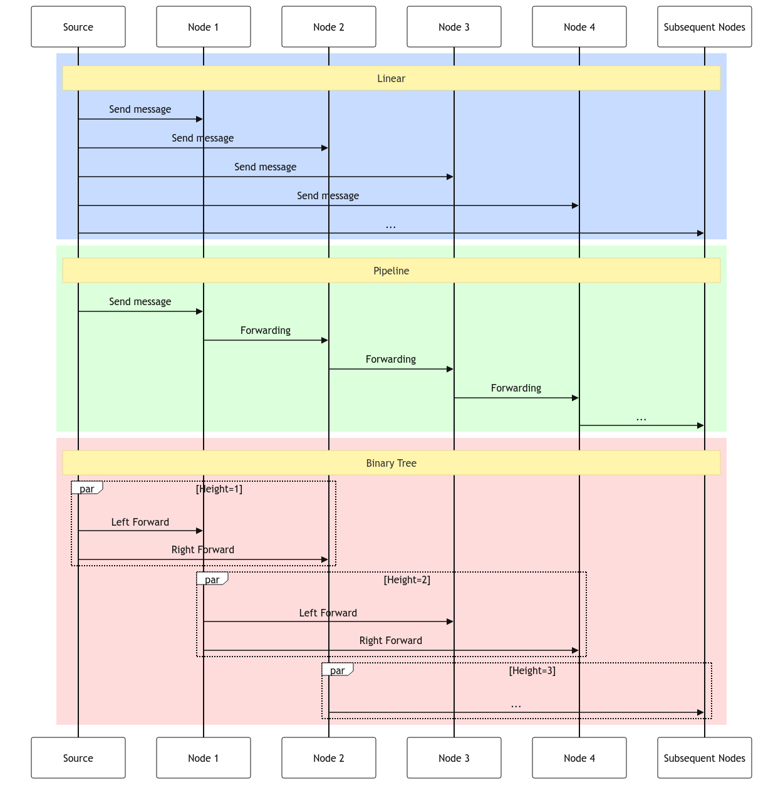 


---
## Overall Analysis

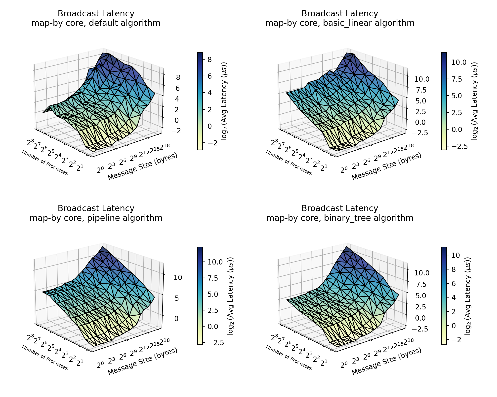

---

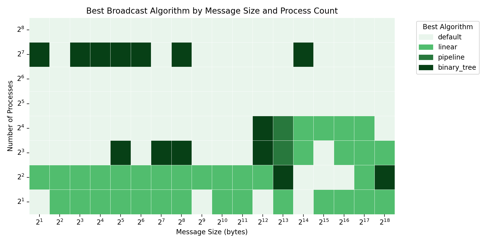

---

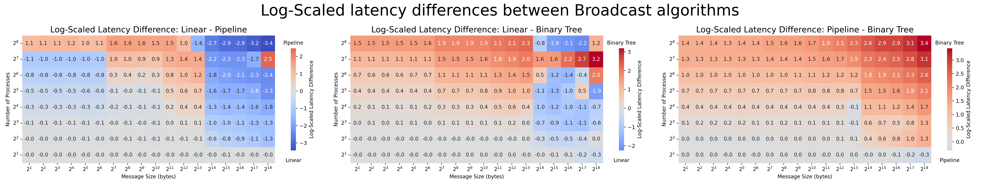
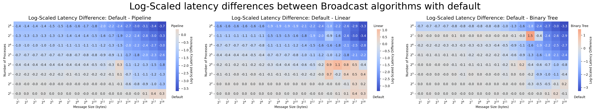

---

### ``scatter``: basic linear, non-blocking, binomial

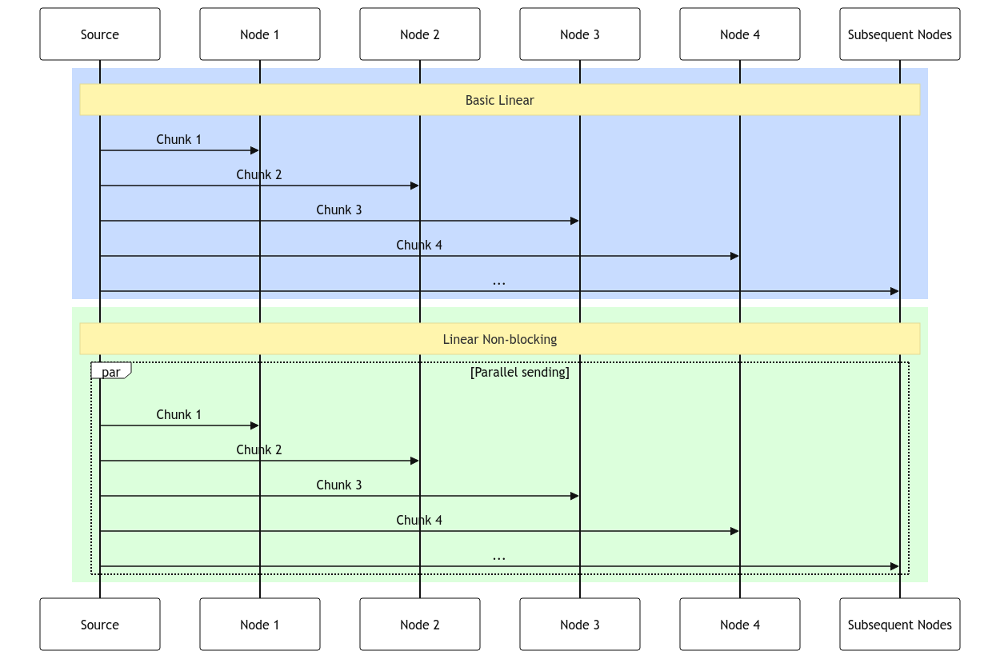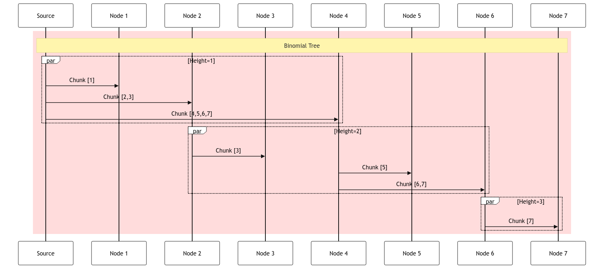 

---

## Overall Analysis


---

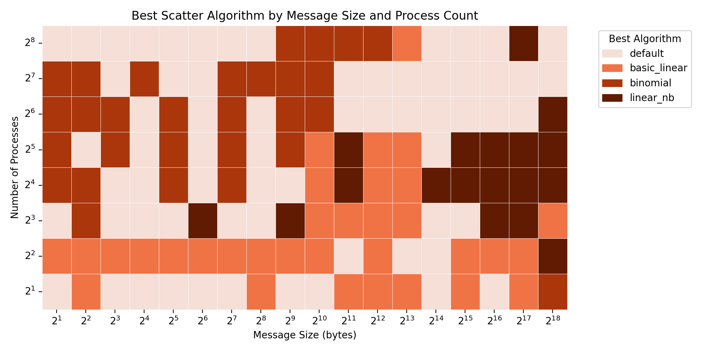

---

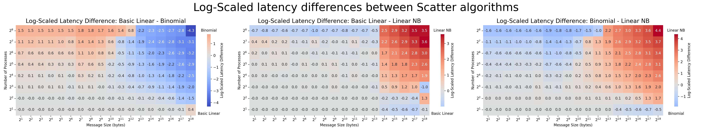
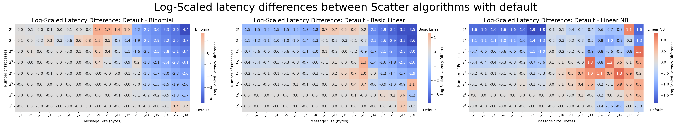

---

## Performance models

* ``--report-bindings`` flag to understand resources allocation
* fixed message size (4 bytes): instataneous data transfer **assumption**
*  point-to-point latency communication between the different node binding:

| Region              | Latency $(\mu s)$ |
| ------------------  | --------- |
| Same CCX            | 0.15   |
| Same CCD, Diff. CCX | 0.31   |
| Same NUMA           | 0.34   |
| Same SOCKET         | 0.36   |
| Diff. SOCKET        | 0.65   |
| Diff. NODE          | 1.82   |


---
## Pipeline model

$$     {T}_{\text{pipeline}}(n) = \sum_{i=0}^{n-1} {T}_{\text{pt2pt}}(i, i+1)  $$

* ${T}_{\text{pipeline}}(n)$:  latency for $n$-th process
* ${T}_{\text{pt2pt}}(i, i+1)$:  communication latency within subsequent processes


---

## Linear model

#### Accounting method for distant processes

$$  {T}_{\text{linear}}(n) = \sum_{i=0}^{n-1} {T}_{\text{pt2pt}}(0, i) \cdot \text{discount}(i)  $$

* ${T}_{\text{pt2pt}}(0, i)$: communication latency within first the $i-$th processes
* $\text{discount}(i)$: discount factor for the $i$-th process, empirically fixed for each region

---

## Binary tree model

$$ {T}_{\text{binary}}(n) = \text{n-proc-pen}(n)+\sum_{i=1}^{H(n)} {T}_{\text{pt2pt}}(i) \cdot \big(1+\text{comm-pen}(i)\big)$$

* ${T}_{\text{pt2pt}}(i)$: latency of the longest communication occurring on the $i$-th level
* $H(n)$: height of the tree at the $n-$th process
* $\text{n-proc-pen}(n)$: penalty factor for the total number of processes
* $\text{comm-pen}(i)$: penalty factor depending on the communications on the $i$-th layer


---
## ``broadcast`` results

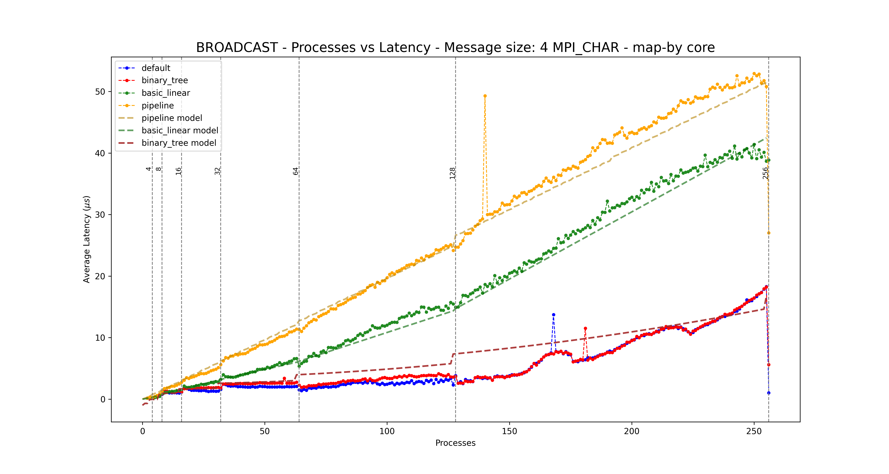

---
## ``scatter`` results

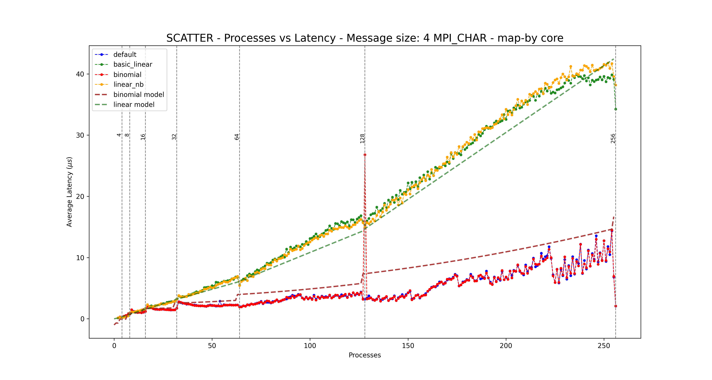

---

### Exercise 2c
# Mandelbrot Set Computation
## Hybrid Implementation


---
## Mandelbrot set

The Mandelbrot set $\mathcal{M}$ emerges on the complex plane $\mathbb{C}$ through the iteration of the function 
$$ f_c(z) = z^2 + c$$
where $c = x + iy$ is a complex number. The process generates the sequence
$$
z_0 = 0,\quad z_1 = f_c(0),\quad z_2 = f_c(z_1),\quad \dots,\quad z_n = f_c(z_{n-1}).
$$
The set comprises all the points $c$ for which this sequence remains bounded. To determine whether a point $c$ is part of $\mathcal{M}$, the following condition is used
$$
|z_n| < 2\quad \text{for all } n \leq I_{\text{max}},
$$


<!-- _class: false -->

---

# Problem statement
1. Implement a hybrid strategy OpenMP+MPI to compute (and then visualize in $\mathbb{R}^2$) the set $\mathcal{M}$
    * Using 1 byte pixels resolution ($I_{\text{max}}=255$)  
    * Returning as output a ``.pgm``image
2. Scale the problem and assess the performances

### Curse of the problem

* <u>Workload balancement</u>

---
# Strategy
* Each point $c_{ij}$, $(i,j)$ element of a $n\times n$ matrix, can be computed independently from the others, within a ```max_iter=255```range, and assigned to the set (or not)
```c
int compute_mandelbrot(double cx, double cy, int max_iter) { // single point computation
    // ... variables definition
    while (x2 + y2 <= 4 && iter < max_iter) {
        y = 2 * x * y + cy;
        x = x2 - y2 + cx;
        x2 = x * x;
        y2 = y * y;
        iter++;
    }
    return iter;
}
```

* The matrix can be divided by rows assigned to MPI processes, each MPI process can divide its work between OMP threads

* Each process writes its own results in the final image using ``MPI_File_write_at()``

<!-- _class: false -->
---

# First attempt: <u> static (MPI) workload </u>

* Rows are evenly and subsequently divided between processes

```c
  int rows_per_process = ny / size;
  int remainder = ny % size;
  int start_row = rank * rows_per_process + (rank < remainder ? rank : remainder);
  int local_rows = rows_per_process + (rank < remainder ? 1 : 0);
```
* Within a single process the computation is dynamically divided between threads using the OMP directive ``schedule(dynamic)``
```c
    #pragma omp parallel for schedule(dynamic)
    for (int j = 0; j < local_rows; j++) {
        for (int i = 0; i < nx; i++) {
            double cx = x_left + i * dx;
            double cy = y_left + (start_row + j) * dy;
            int iter = 255 - compute_mandelbrot(cx, cy, max_iter);
            local_image[j * nx + i] = (unsigned char)(iter == max_iter ? 1 : iter);
        }
    }
```
<!-- _class: false -->
---
# Scaling
$$\text{Size of the image} = n\times n$$
* **Weak scaling**: The size is increased linearly with the workers (processes or threads), setting $n=\sqrt{W\times c}$ where $c$ determines a constant workload, $c=1\text{MB}$
* **Strong scaling**: The size is fixed at $n=10000$, the workers are linearly increased

<div class="block-language-tx">
<table>

<thead>
<tr>
<th></th>
<th style="text-align:center" colspan="2">OMP</th>
<th style="text-align:center" colspan="2">MPI</th>
</tr>
<tr>
<th></th>
<th style="text-align:center" >Strong</th>
<th style="text-align:center" >Weak</th>
<th style="text-align:center" >Strong</th>
<th style="text-align:center" >Weak</th>
</tr>
</thead>
<tbody>
<tr>
<td style="text-align:left"><strong>Processes</strong></td>
<td style="text-align:center">1</td>
<td style="text-align:center">1</td>
<td style="text-align:center">[1-256]</td>
<td style="text-align:center">[1-256]</td>
</tr>
<tr>
<td style="text-align:left"><strong>Threads</strong></td>
<td style="text-align:center">[1-128]</td>
<td style="text-align:center">[1-128]</td>
<td style="text-align:center">1</td>
<td style="text-align:center">1</td>
</tr>
</tbody>
<tbody>
<tr>
<td style="text-align:left"><strong>Size (pixels)</strong></td>
<td style="text-align:center">10000</td>
<td style="text-align:center">n</td>
<td style="text-align:center">10000</td>
<td style="text-align:center">n</td>
</tr>
</tbody>
</table>
</div>

---
# Analysis
Considering $N$ workers to analyze the scaling we consider:
## Strong scaling
* Speedup and Efficiency
$$ \text{S}(N) = \frac{T(1)}{T(N)}\quad \text{and}\quad \text{E}(N) = \frac{S(N)}{N} $$
## Weak scaling
* Scaled speedup and Efficiency
$$ \text{S}(N) = \frac{T(1)}{T(N)}\cdot N\quad \text{and}\quad \text{E}(N) = \frac{S(N)}{N} $$
<!-- _class: false -->
---

 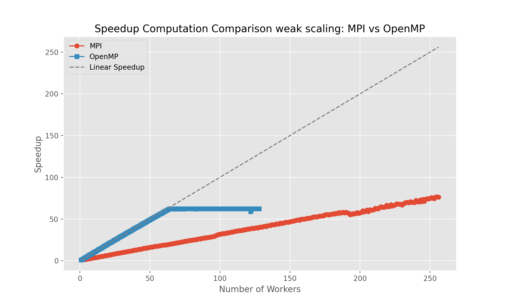

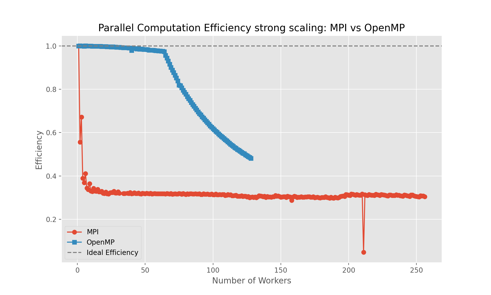 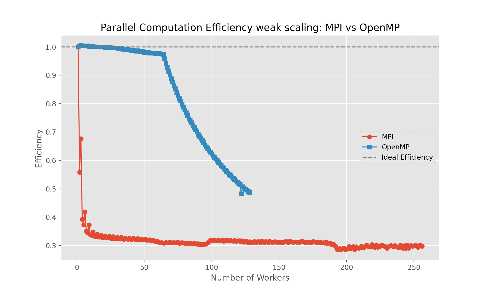

---
# Evaluation
Considering $N$ workers to assess the scaling (and the program itself) we consider $f$ the serial workload fraction of the program and $(1-f)$ the parallel workload fraction:
## Strong scaling
* Amdhal's law
$$     S_{A}(N) = \frac{1}{f+({1-f})/{N}} $$
## Weak scaling

* Gustafson's law
$$  S_{G}(N) = f + (1-f)\cdot N  $$

<!-- _class: false -->

---

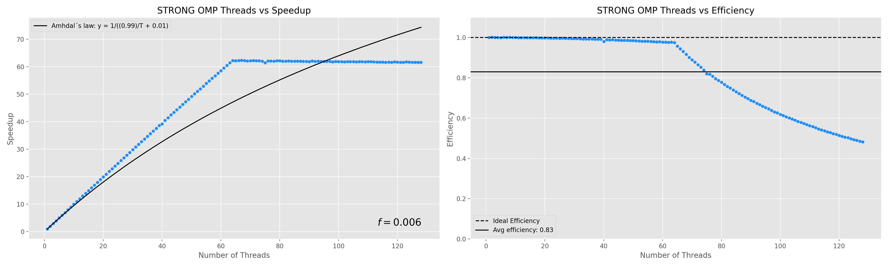 
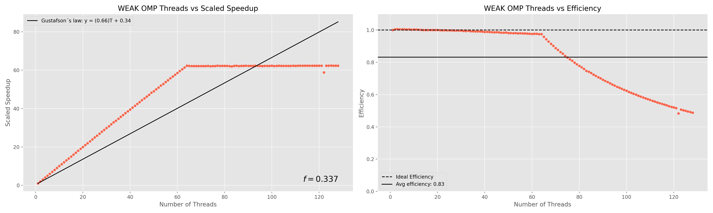

---

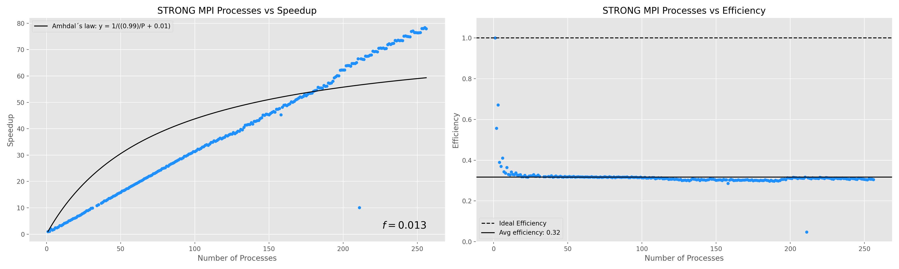 
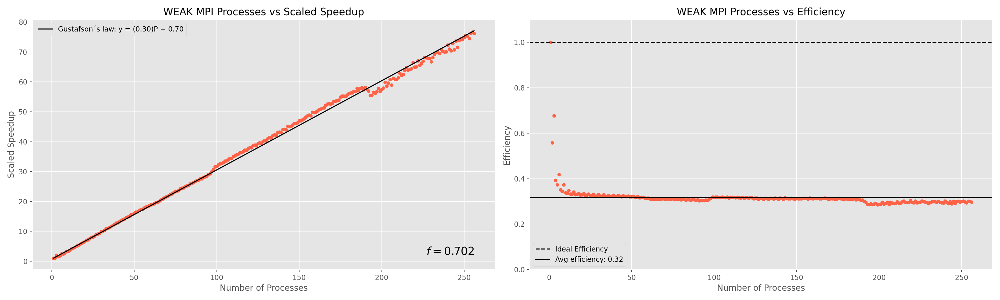

---


```python
def iterative_solution(initial_beta, epsilon=1e-6):
    beta_current = initial_beta
    while True:
        beta_next = update_beta(beta_current)
        if norm(beta_next - beta_current) < epsilon:
            return beta_next
        beta_current = beta_next
```

---
## Conclusions

### Key Findings
- Theoretical contribution
- Practical implications
- Future research directions

### References
1. Author, A. (Year). *Title*. Journal
2. Author, B. (Year). *Title*. Conference

